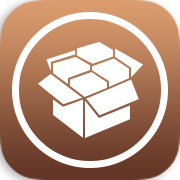

  

<h1 align="center">AnhTuan201X Repo 🚀</h1>

  Kho lưu trữ Tweak và ứng dụng Legacy dành riêng cho thiết bị iOS cũ.

  <b>iOS 3 · iOS 5 · iOS 6 · iOS 7</b>

  

## 📱 Hướng dẫn thêm nguồn vào Cydia

1. Mở **Cydia** trên iPhone/iPad.
2. Vào **Sources**.
3. Nhấn **Edit**.
4. Nhấn **Add**.
5. Nhập địa chỉ:

https://anhtuan201x.github.io/

6. Nhấn **Add Source**.
7. Chờ Cydia tải Packages hoàn tất.

## 📦 Nội dung repo

* 🛠️ Tweak cho iOS Legacy
* 📱 Ứng dụng dành cho iOS cũ
* 📦 Package `.deb`
* 🔧 Công cụ hỗ trợ thiết bị Legacy
* 📚 Tài nguyên và phần mềm cho các phiên bản iOS cũ

## ⚡ Tính năng

* 🌐 Phân phối package thông qua GitHub Pages.
* 📦 Hỗ trợ package `.deb` cho Cydia/APT.
* 📱 Tập trung vào iOS Legacy.
* 🔧 Có thể mở rộng thêm package trong tương lai.

## 🌐 Liên kết

**My Website:**

https://anhtuan201x.github.io/

**GitHub Repository:**

https://github.com/anhtuan201x/anhtuan201x.github.io

## ⚠️ Lưu ý

Repo này dành cho mục đích **nghiên cứu, bảo tồn và sử dụng phần mềm trên thiết bị iOS Legacy**.

Khả năng tương thích của từng package phụ thuộc vào phiên bản iOS, kiến trúc CPU và jailbreak đang sử dụng.

  <b>© 2026 AnhTuan201X</b>

